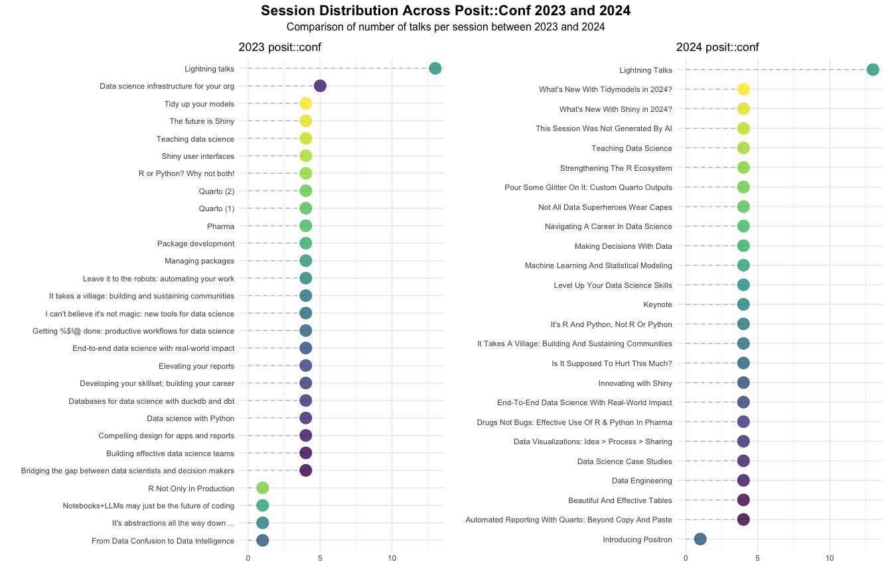

## Prepare data

``` r
# List of packages

packages <- c("tidyverse", "patchwork")

# Load packages

lapply(packages, library, character.only = TRUE)
```

    ## [[1]]
    ##  [1] "forcats"   "stringr"   "dplyr"     "purrr"     "readr"     "tidyr"     "tibble"    "ggplot2"   "tidyverse" "stats"     "graphics"  "grDevices"
    ## [13] "utils"     "datasets"  "methods"   "base"     
    ## 
    ## [[2]]
    ##  [1] "patchwork" "forcats"   "stringr"   "dplyr"     "purrr"     "readr"     "tidyr"     "tibble"    "ggplot2"   "tidyverse" "stats"     "graphics" 
    ## [13] "grDevices" "utils"     "datasets"  "methods"   "base"

``` r
# Read in data sets from 2023 and 2024

conf2023 <- readr::read_csv('https://raw.githubusercontent.com/rfordatascience/tidytuesday/main/data/2025/2025-01-14/conf2023.csv')
conf2024 <- readr::read_csv('https://raw.githubusercontent.com/rfordatascience/tidytuesday/main/data/2025/2025-01-14/conf2024.csv')


# Remove duplicates in session title

conf_2023_deduplicated <- conf2023 %>% distinct(session_title, .keep_all = TRUE)
conf_2024_deduplicated <- conf2024 %>% distinct(talk_title, .keep_all = TRUE)

# Prepare data sets to plot number of talks for 2023 and 2024

df_plot_2023 <- conf_2023_deduplicated %>% group_by(block_track_title) %>% count() %>% as_tibble()
df_plot_2024 <- conf_2024_deduplicated %>% group_by(track) %>% count() %>% as_tibble()
```

## Plot data

``` r
# Function to plot data

lollipop_plot <- function(df, block_column,plot_title) {
  ggplot(df, aes(x = n, y = reorder({{ block_column }}, n), color = {{ block_column }})) +
    geom_segment(aes(x = 0, xend = n, y = reorder({{ block_column }}, n), yend = reorder({{block_column}},n)),linetype = "dashed", color = "grey") +
    geom_point(size = 6, alpha = 0.8) +
    theme_minimal() +
    labs(title = plot_title, x = "Count (n)", y = "", color = "Session Title") +
    theme(legend.position = "none", axis.title.x.bottom = element_blank()) +
    scale_colour_viridis_d()
}

# Generate lollipop plot for 2023

lollipop_2023 <- lollipop_plot( df = df_plot_2023, block_column =  block_track_title, plot_title = "2023 posit::conf")

# Generate lollipop plot for 2024

lollipop_2024 <-  lollipop_plot( df = df_plot_2024, block_column =  track, plot_title = "2024 posit::conf")

# Combine 2023 and 2024 plots

combined_plot <- lollipop_2023 + lollipop_2024 + 
  plot_annotation(
    title = "Session Distribution Across Posit::Conf 2023 and 2024",
    subtitle = "Comparison of number of talks per session between 2023 and 2024",
    theme = theme(
      plot.title = element_text(size = 16, face = "bold", hjust = 0.5),
      plot.subtitle = element_text(size = 12, hjust = 0.5)
    )
  )

# Print combined plot

print(combined_plot)
```

<!-- -->

